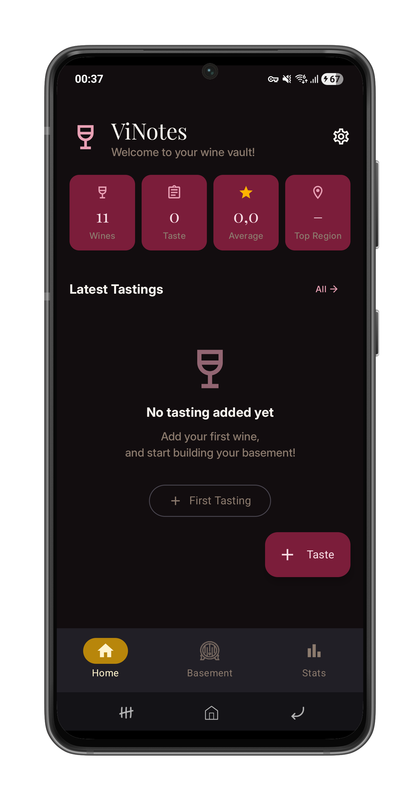
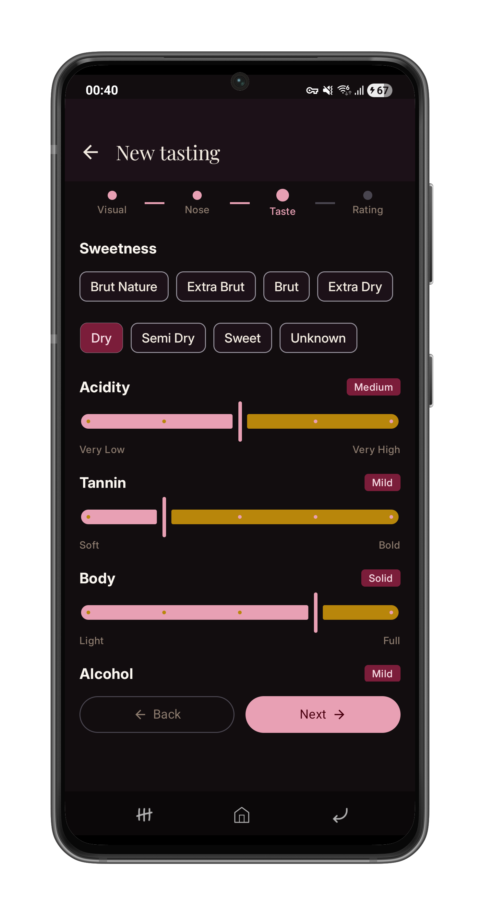
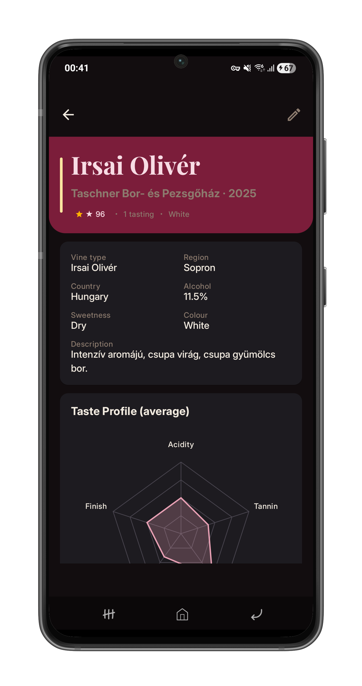
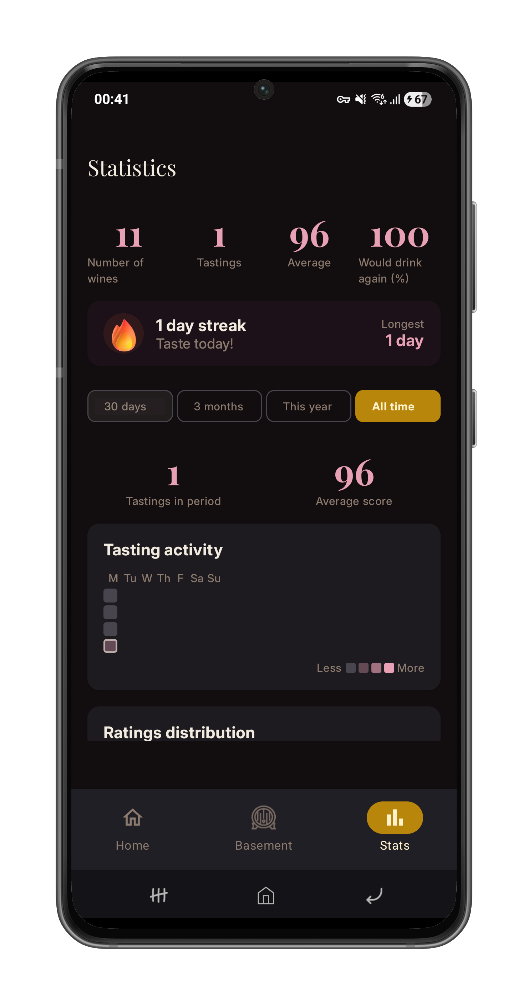

<div align="center">

# ViNotes

### A beautiful, privacy-friendly wine tasting journal for Android

*Score wines. Remember experiences. Discover patterns.*

<br/>

[](https://android.com)
[](https://kotlinlang.org)
[](https://developer.android.com/jetpack/compose)
[](LICENSE)
<!-- [](https://f-droid.org) -->

<br/>

<!--  -->

</div>

## What is ViNotes?

ViNotes is a **free, open-source** wine tasting journal for Android. It lets you score and document wines across four dimensions — appearance, nose, palate, and finish — so you can build a personal record of every bottle you've ever tried.

Whether you're casually curious or a seasoned enthusiast, ViNotes helps you remember what you tasted, where you tried it, and whether you'd drink it again.

**No ads. No accounts. No Google Play Services required.** Your tasting notes live on your device.

## Features

- 🍷 **Structured tasting notes** — score wines on clarity, colour intensity, nose, palate, finish and more, following a professional tasting framework
- 📋 **Wine cellar** — browse, filter and search all your wines by region, vintage or grape variety
- 📊 **Statistics** — visualise your ratings by year and region with interactive charts
- 📍 **One-tap location** — autofill the venue field using your GPS position with reverse geocoding via OpenStreetMap
- 🔄 **Catalog sync** — download a curated wine database and keep it up to date with delta syncing
- 📁 **Local JSON import** — import your own wine catalogue from a file, no internet required
- 🌙 **Dark & light theme** — fully themed UI with a warm, elegant wine-inspired palette
- 🔒 **Privacy-first** — works completely offline, no account needed, no tracking

## Screenshots

<!-- Add your own screenshots here -->
<!-- Use the Android Device Art Generator for framing: https://developer.android.com/distribute/marketing-tools/device-art-generator -->

|        Dashboard        |         Tasting Form         |        Wine Detail        |         Statistics         |
|:-----------------------:|:----------------------------:|:-------------------------:|:--------------------------:|
|  |  |  |  |

## Tech Stack

ViNotes is built with modern Android development practices from the ground up.

| Layer                    | Technology                                                                    |
|--------------------------|-------------------------------------------------------------------------------|
| **UI**                   | [Jetpack Compose](https://developer.android.com/jetpack/compose) + Material 3 |
| **Architecture**         | MVI (Model–View–Intent)                                                       |
| **Dependency Injection** | [Hilt](https://dagger.dev/hilt/)                                              |
| **Local Database**       | [Room](https://developer.android.com/jetpack/androidx/releases/room) (SQLite) |
| **Networking**           | [Retrofit](https://square.github.io/retrofit/) + kotlinx.serialization        |
| **Location**             | Android `LocationManager`                                                     |
| **Geocoding**            | [Nominatim](https://nominatim.org/) (OpenStreetMap)                           |
| **Charts**               | [MPAndroidChart](https://github.com/PhilJay/MPAndroidChart)                   |
| **Image loading**        | [Coil](https://coil-kt.github.io/coil/)                                       |
| **Date handling**        | [kotlinx.datetime](https://github.com/Kotlin/kotlinx-datetime)                |

### Architecture overview

Every screen follows a strict MVI pattern with four dedicated files — `State`, `Event`, `Effect`, and `ViewModel`. ViewModels are pure Kotlin with no Android framework dependencies except through injected use cases, making the business logic fully testable.

```plain
UI Layer        Composables collect State, send Events
    ↕
ViewModel       Processes Events → updates State, emits Effects
    ↕
Use Cases       Single-responsibility business logic
    ↕
Repositories    Abstract data sources behind interfaces
  ↙     ↘
Room    Retrofit
```

## Wine Catalogue

ViNotes ships with a community-maintained wine catalogue hosted on GitHub Pages. The sync system is designed to be lightweight and bandwidth-friendly:

- **`manifest.json`** — fetched first; lists all available files with checksums
- **`full.json`** — the complete catalogue, used on first install or manual reset
- **`delta-YYYY-MM-DD.json`** — incremental updates with only added, changed, or removed wines

The app tracks the last applied delta date in Room and only downloads what it hasn't seen yet. A GitHub Action automatically regenerates the delta files and updates the manifest whenever the source catalogue changes.

> Want to add wines to the catalogue? Contributions are welcome in the [catalog branch](https://github.com/T0liver/ViNotes/tree/catalogue)! Add your own issue/pull request!

## Getting Started

### Requirements

- Android 8.0 (API 26) or higher
- Android Studio Hedgehog or newer (for building from source)

### Build from source

```bash
git clone https://github.com/T0liver/vinotes.git
cd vinotes
./gradlew assembleDebug
```

Install on a connected device:
```bash
adb install app/build/outputs/apk/debug/app-debug.apk
```

### Download

| Source     | Link                                                           |
|------------|----------------------------------------------------------------|
| F-Droid    | *coming soon*                                                  |
| Direct APK | [Releases](https://github.com/T0liver/ViNotes/releases/latest) |

---

## Contributing

Contributions of all kinds are welcome!

- 🐛 **Found a bug?** Open an [issue](https://github.com/T0liver/ViNotes/issues) with steps to reproduce
- 💡 **Have an idea?** Open an issue with the `enhancement` label
- 🍷 **Know your wines?** Add entries to the [wine catalog](https://github.com/T0liver/ViNotes/tree/catalogue/source)!
- 🔧 **Want to code?** Fork the repo and open a pull request — please discuss larger changes in an issue first

### A few guidelines

- Follow the existing MVI pattern for any screen changes
- No proprietary libraries — keep it F-Droid compatible
- New screens need all five files: `State`, `Event`, `Effect`, `ViewModel`, `Screen`
- Match the code style and naming conventions already in the project

---

## License

See [LICENCE](LICENSE) for the full licence text.

---

## Acknowledgements

- [OpenStreetMap](https://www.openstreetmap.org/) contributors & [Nominatim](https://nominatim.org/) for free, open geocoding
- [MPAndroidChart](https://github.com/PhilJay/MPAndroidChart) by Philipp Jahoda for the chart library
- [Shields.io](https://shields.io) for the README badges

---

<div align="center">
  Made with ❤️ and 🍷
</div>